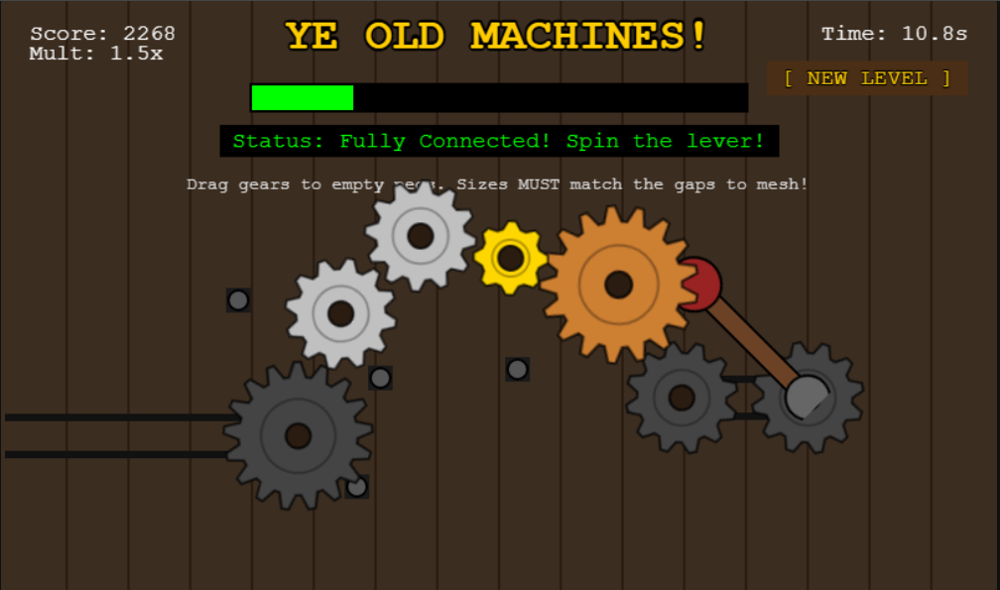

# Ye Old Machines!

A gear-based puzzle game where you must assemble and power a complex machine by connecting gears from input to output. Built for **Gamedev.js Jam 2026** with the theme **Machines**.

## 🎮 How to Play

Your goal is to connect the **input gear** (right side) to the **output gear** (left side) by placing gears from your toolbox onto empty pegs.

### Controls
- **Drag & Drop**: Drag gears from the toolbox at the bottom onto empty circular pegs
- **Spin the Lever**: Click and drag the lever handle (right side) clockwise to power your machine
- **New Level**: Click `[ NEW LEVEL ]` to generate a fresh puzzle

### Rules
- Gears must be placed on empty pegs **only** (the grey circular bases)
- **Size matters**: Gears must physically touch to mesh — the distance between peg centers must equal the sum of their radii
- Large gears (60px) have bronze color, medium gears (45px) are silver, small gears (30px) are gold
- Some pegs have **fixed gears** (dark grey) that cannot be moved — use them as part of your solution

### Scoring
- Score increases as you turn the lever while the machine is fully connected
- **Multiplier bonus**: Keep empty pegs for a higher multiplier (up to 1.5x with 3+ empty pegs)
- **Time penalty**: The longer you take, the more your score drains
- Progress bar shows how close you are to completing the level

### Winning
Connect input → output with a valid gear chain, then spin the lever! When the progress bar fills, you'll get a **SHARE HIGHSCORE** button to save your achievement.

## 🏗️ The Machine Architecture

The game features:
- Procedurally generated puzzle layouts with random gear paths
- Distractor pegs placed around the machine to increase difficulty
- Visual chains and drive belts connecting the lever system
- Realistic gear rotation physics (gears turn in opposite directions based on size ratio)

## 🛠️ Built With

- **Phaser 4** – HTML5 game framework
- Pure JavaScript – no build step required
- Procedurally generated textures – all assets created at runtime

## 🎯 Jam Submission

This game was created in just a few days for:

**Gamedev.js Jam 2026**  
Theme: **Machines**  
https://itch.io/jam/gamedevjs-2026

## 👾 Play It

Check out the game on my itch.io page:  
https://tomazellagames.itch.io/ye-old-machines

---

*Crafted with ⚙️ and ☕ for the love of old-school machinery.*
